# Estruturação de Banco de Dados Relacional para Análise de Vendas

> **PostgreSQL · DBeaver · SQL · Modelagem Relacional**

---

## O Problema

Uma empresa com **10 filiais distribuídas em todo o Brasil** operava seus dados de vendas inteiramente em arquivos CSV — sem estrutura relacional, sem integridade de dados e sem capacidade de cruzar informações entre clientes, produtos e regiões.

A diretoria não conseguia responder perguntas básicas como:
- Quais clientes concentram o maior volume de compras?
- Quais produtos lideram as vendas por marca em um período específico?
- Como as receitas se distribuem entre as regiões do país por filial?

Sem um banco estruturado, cada análise exigia trabalho manual no CSV, lento, sujeito a erro e impossível de escalar.

---

## A Solução

Projetei e implementei um banco de dados relacional em PostgreSQL que transformou **18.710 registros brutos** em uma estrutura normalizada, íntegra e pronta para consultas analíticas.

O pipeline completo cobriu:

- **Ingestão** dos dados brutos via tabela de staging
- **Modelagem** em esquema estrela com 4 tabelas normalizadas
- **Validações de negócio** aplicadas como constraints no banco
- **Carga** das dimensões e tabela fato com integridade referencial garantida
- **Análises estratégicas** respondendo às perguntas da diretoria
- **VIEW consolidada** com pivot de vendas por filial e região do Brasil

---

## Resultados Entregues

### Top 5 Clientes por Volume de Compras

| Posição | Cliente | Unidades Compradas |
|---|---|---|
| 1º | Cliente 41 | 993 |
| 2º | Cliente 39 | 976 |
| 3º | Cliente 95 | 973 |
| 4º | Cliente 24 | 946 |
| 5º | Cliente 31 | 941 |

### Top 3 Produtos por Volume de Vendas

| Posição | Produto | Unidades Vendidas |
|---|---|---|
| 1º | Produto 11 | 4.686 |
| 2º | Produto 9 | 4.645 |
| 3º | Produto 18 | 4.603 |

### Produto Líder por Marca — Jul a Dez/2023

| Marca | Produto Mais Vendido | Unidades |
|---|---|---|
| Marca 1 | Produto 7 | 556 |
| Marca 2 | Produto 9 | 548 |
| Marca 3 | Produto 14 | 481 |

### Receita por Filial e Região (amostra)

| Filial | Norte | Nordeste | Centro-Oeste | Sudeste | Sul | **Total** |
|---|---|---|---|---|---|---|
| Filial 1 | 75.360 | 149.089 | 52.993 | 63.508 | 32.668 | **373.618** |
| Filial 8 | 86.618 | 139.925 | 51.651 | 69.394 | 32.887 | **380.477** |
| Filial 2 | 85.071 | 141.095 | 50.885 | 67.658 | 33.978 | **378.689** |

> Valores em R$. View completa disponível no script SQL.

---

## Modelagem do Banco

O modelo parte de uma tabela de staging (dados brutos do CSV) e normaliza em um **esquema estrela**:

```
tbl_clientes ──────────────────────────┐
(codigo_cliente PK, nome_cliente, uf)  │
                                       ▼
                              tbl_pedidos (FATO)
tbl_filiais ──────────────►  nr_pedido + codigo_produto (PK composta)
(codigo_filial PK, nome)     dt_momento, quantidade, avaliacao
                                       │
tbl_produtos ──────────────────────────┘
(codigo_produto PK, nome_produto, marca, preco_unitario)
```
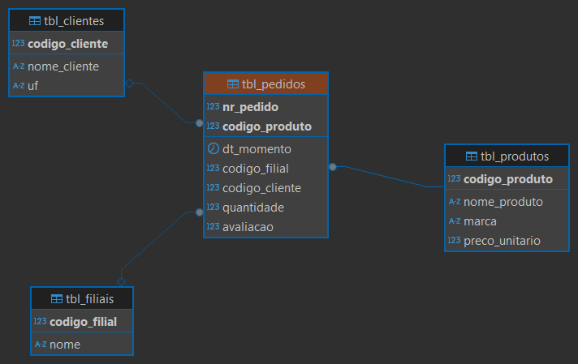

**Regras de negócio aplicadas como constraints:**
- `quantidade` aceita somente valores positivos
- `preco_unitario` não aceita nulos nem valores ≤ 0
- `avaliacao` aceita somente valores entre 1 e 5
- Integridade referencial garantida via Foreign Keys em todas as relações

**Volume de dados após carga:**

| Tabela | Registros |
|---|---|
| tbl_clientes | 100 |
| tbl_filiais | 10 |
| tbl_produtos | 19 |
| tbl_pedidos | 18.710 |

---

## Implementação

### Passo 1 — Staging: ingestão dos dados brutos

A tabela `staging_vendas` recebe o CSV sem transformações, preservando os dados originais para auditoria.

```sql
CREATE TABLE staging_vendas (
    nr_pedido INT, dt_momento TIMESTAMP,
    codigo_filial INT, nome_filial VARCHAR(255),
    codigo_cliente INT, nome_cliente VARCHAR(255),
    uf CHAR(2), codigo_produto INT,
    descricao_produto VARCHAR(255), marca VARCHAR(100),
    preco_unitario DECIMAL(10,2), quantidade INT, avaliacao INT
);
```

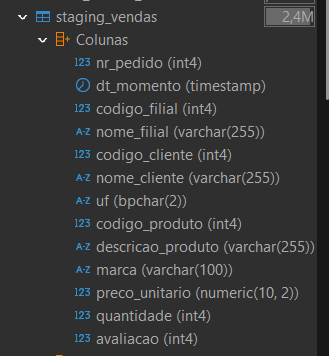

---

### Passo 2 — Importação com COPY

```sql
COPY staging_vendas FROM 'C:/dados/dataset_PA.csv'
WITH (FORMAT CSV, HEADER, DELIMITER ',', ENCODING 'UTF8');
```

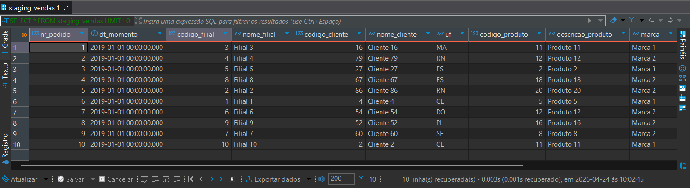

---

### Passo 3 — Dimensionamento dos campos com LENGTH

Antes de criar as tabelas, consultei o tamanho real dos campos para evitar desperdício de armazenamento ou truncamento de dados.

```sql
SELECT
    MAX(LENGTH(nome_filial))       AS tam_filial,
    MAX(LENGTH(nome_cliente))      AS tam_cliente,
    MAX(LENGTH(uf))                AS tam_uf,
    MAX(LENGTH(descricao_produto)) AS tam_produto,
    MAX(LENGTH(marca))             AS tam_marca
FROM staging_vendas;
```

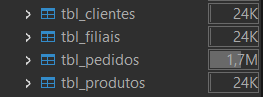

---

### Passos 4 e 5 — Criação das tabelas com validações

```sql
CREATE TABLE tbl_produtos (
    codigo_produto INT PRIMARY KEY,
    nome_produto VARCHAR(255),
    marca VARCHAR(100),
    preco_unitario DECIMAL(10,2) NOT NULL CHECK (preco_unitario > 0)
);

CREATE TABLE tbl_pedidos (
    nr_pedido INT,
    dt_momento TIMESTAMP,
    codigo_filial  INT REFERENCES tbl_filiais(codigo_filial),
    codigo_cliente INT REFERENCES tbl_clientes(codigo_cliente),
    codigo_produto INT REFERENCES tbl_produtos(codigo_produto),
    quantidade INT CHECK (quantidade > 0),
    avaliacao  INT CHECK (avaliacao BETWEEN 1 AND 5),
    PRIMARY KEY (nr_pedido, codigo_produto)
);
```

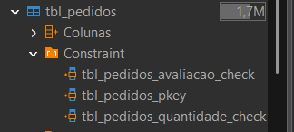

---

### Passo 6 — Carga nas tabelas normalizadas

`SELECT DISTINCT` garante que cada dimensão receba apenas registros únicos, mesmo que o CSV contenha repetições.

```sql
INSERT INTO tbl_clientes (codigo_cliente, nome_cliente, uf)
SELECT DISTINCT codigo_cliente, nome_cliente, uf FROM staging_vendas;

INSERT INTO tbl_filiais (codigo_filial, nome)
SELECT DISTINCT codigo_filial, nome_filial FROM staging_vendas;

INSERT INTO tbl_produtos (codigo_produto, nome_produto, marca, preco_unitario)
SELECT DISTINCT codigo_produto, descricao_produto, marca, preco_unitario FROM staging_vendas;

INSERT INTO tbl_pedidos (nr_pedido, dt_momento, codigo_filial, codigo_cliente, codigo_produto, quantidade, avaliacao)
SELECT nr_pedido, dt_momento, codigo_filial, codigo_cliente, codigo_produto, quantidade, avaliacao
FROM staging_vendas;
```

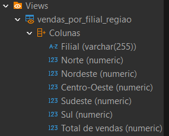

---

### Passo 7 — Integridade referencial
- Quantidade de registros por tabela

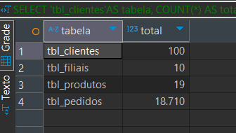

---

### Passo 8 — Top 5 clientes por volume

```sql
SELECT c.nome_cliente, SUM(p.quantidade) AS total_volumes
FROM tbl_pedidos p
JOIN tbl_clientes c ON p.codigo_cliente = c.codigo_cliente
GROUP BY c.nome_cliente
ORDER BY total_volumes DESC
LIMIT 5;
```

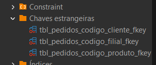

---

### Passo 9 — Top 3 produtos por volume

```sql
SELECT pr.nome_produto, SUM(p.quantidade) AS total_volumes
FROM tbl_pedidos p
JOIN tbl_produtos pr ON p.codigo_produto = pr.codigo_produto
GROUP BY pr.nome_produto
ORDER BY total_volumes DESC
LIMIT 3;
```

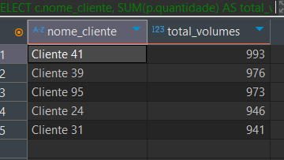

---

### Passo 10 — Produto líder por marca (Jul–Dez/2023)

`DISTINCT ON` é um recurso nativo do PostgreSQL que retorna apenas a primeira linha de cada grupo após a ordenação — eliminando a necessidade de subquery ou CTE para esse tipo de análise.

```sql
SELECT DISTINCT ON (pr.marca)
    pr.marca, pr.nome_produto,
    SUM(p.quantidade) AS total_vendido
FROM tbl_pedidos p
JOIN tbl_produtos pr ON p.codigo_produto = pr.codigo_produto
WHERE p.dt_momento BETWEEN '2023-07-01' AND '2023-12-31'
GROUP BY pr.marca, pr.nome_produto
ORDER BY pr.marca, total_vendido DESC;
```

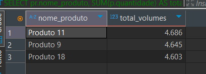

---

### Passo 11 — VIEW Pivot: vendas por filial e região

Pivot manual com `CASE WHEN`, classificando cada UF na macrorregião do IBGE correspondente.

```sql
CREATE OR REPLACE VIEW vendas_por_filial_regiao AS
SELECT
    f.nome AS "Filial",
    ROUND(SUM(CASE WHEN c.uf IN ('AM','RR','AP','PA','TO','RO','AC')
              THEN (p.quantidade * pr.preco_unitario) ELSE 0 END)::numeric, 2) AS "Norte",
    ROUND(SUM(CASE WHEN c.uf IN ('MA','PI','CE','RN','PE','PB','SE','AL','BA')
              THEN (p.quantidade * pr.preco_unitario) ELSE 0 END)::numeric, 2) AS "Nordeste",
    ROUND(SUM(CASE WHEN c.uf IN ('MT','MS','GO','DF')
              THEN (p.quantidade * pr.preco_unitario) ELSE 0 END)::numeric, 2) AS "Centro-Oeste",
    ROUND(SUM(CASE WHEN c.uf IN ('SP','RJ','ES','MG')
              THEN (p.quantidade * pr.preco_unitario) ELSE 0 END)::numeric, 2) AS "Sudeste",
    ROUND(SUM(CASE WHEN c.uf IN ('PR','SC','RS')
              THEN (p.quantidade * pr.preco_unitario) ELSE 0 END)::numeric, 2) AS "Sul",
    ROUND(SUM(p.quantidade * pr.preco_unitario)::numeric, 2) AS "Total de vendas"
FROM tbl_pedidos p
JOIN tbl_filiais f  ON p.codigo_filial  = f.codigo_filial
JOIN tbl_clientes c ON p.codigo_cliente = c.codigo_cliente
JOIN tbl_produtos pr ON p.codigo_produto = pr.codigo_produto
GROUP BY f.nome
ORDER BY f.nome;
```

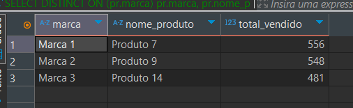

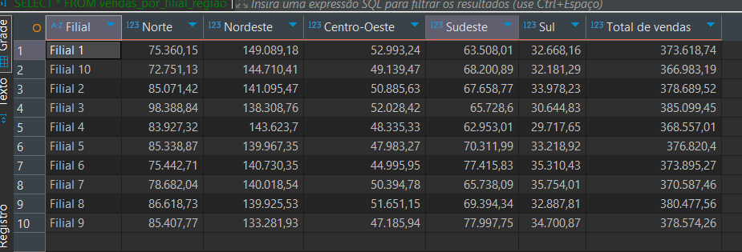

---

### Passo 12 — Acumulado de vendas por filial e UF

Window Function `SUM() OVER (PARTITION BY ... ORDER BY ...)` para calcular o acumulado progressivo de receita dentro de cada filial, ordenado por UF.

```sql
SELECT
    f.codigo_filial AS "Filial",
    f.nome          AS "nome",
    c.uf            AS "UF",
    ROUND(SUM(SUM(p.quantidade * pr.preco_unitario)) OVER (
        PARTITION BY f.codigo_filial
        ORDER BY c.uf
    )::numeric, 2) AS "Total de vendas"
FROM tbl_pedidos p
JOIN tbl_filiais f  ON p.codigo_filial  = f.codigo_filial
JOIN tbl_clientes c ON p.codigo_cliente = c.codigo_cliente
JOIN tbl_produtos pr ON p.codigo_produto = pr.codigo_produto
GROUP BY f.codigo_filial, f.nome, c.uf
ORDER BY f.codigo_filial, c.uf;
```

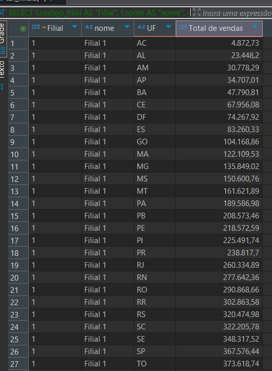

---

## Stack e Conceitos Aplicados

`PostgreSQL` · `DBeaver` · `Modelagem Relacional` · `ETL` · `Window Functions` · `Views` · `Constraints` · `Foreign Keys` · `Pivot com CASE WHEN` · `DISTINCT ON`

---

## Como Reproduzir

```bash
# 1. Crie um banco no PostgreSQL
createdb vendas_db

# 2. Coloque o dataset_PA.csv em C:/dados/
#    (ou ajuste o caminho no Passo 2 do script)

# 3. Execute o script completo
psql -U postgres -d vendas_db -f script-banco-de-dados.sql
```

---

*Projeto desenvolvido no Ciclo 08 da formação em Análise de Dados — ComunidadeDS*
